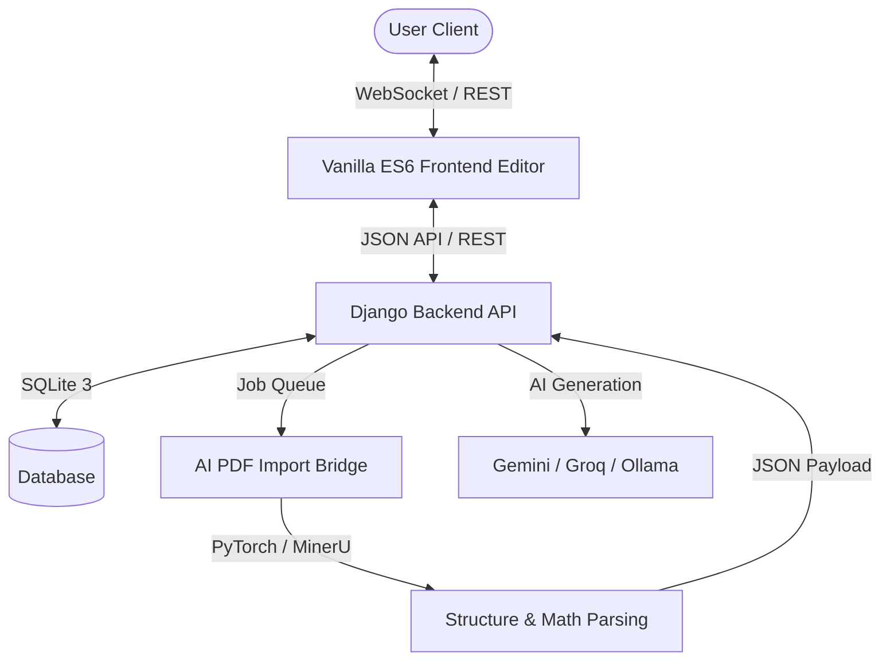

# SlideForge — Professional AI-Powered Presentation Builder

[](https://www.python.org/)
[](https://www.djangoproject.com/)
[](LICENSE)
[](#technology-stack)

SlideForge is a professional, standalone, Figma-like web presentation builder. It seamlessly blends high-fidelity interactive frontend canvas editing with an intelligent Django-based AI slide generation backend. SlideForge supports PDF structure extraction, Gemini/Groq-first slide authoring, dynamic mathematical re-tinting, and a robust advanced slide animation engine.

---

## 🚀 Key Features

*   **Figma-Like Canvas Editor:** Drag-and-drop element resizing, smart alignment guides, double-click text editing, and real-time canvas properties.
*   **Gemini-First AI slide Writing:** Dynamic generation of cohesive scientific and corporate slide decks from simple prompts or uploaded documents using Gemini, Groq, or local Ollama.
*   **AI PDF Structural Extraction:** Integrates a Python PDF parser bridge (`pdf_bridge.py`) that uses local PyTorch/MinerU to extract documents, visual elements, and math/equations directly into slide structures.
*   **Dynamic, Theme-Aware Slide Presets:** Instantly apply corporate or scientific layout templates (Title Page, Section Divider, Results/Data, OPES Sampling, etc.). Presets dynamically recompute colors, background washes, and typography instantly when the presentation theme changes.
*   **Advanced Animation Timeline & Engine:** Create rich transitions using type-specific animations (such as *TextMorph*, *MoveAlongPath*, and *Blur*). Manage sequences with a granular keyframe timeline inspector.
*   **Professional Exporting Options:** Download presentations natively as PowerPoint (`.pptx`) decks or structure-rich JSON files.

---

## 🛠️ Architecture Overview



### Component Details
*   **Frontend Studio (`studio/`, `js/`, `css/`):** A lightweight, premium vanilla ES6 editor. Custom properties and native CSS layout systems are used instead of heavy frameworks, achieving maximum page speed and sub-10ms canvas rendering.
*   **Django Backend (`pptmaker_backend/`, `ai_jobs/`):** Handles secure authentication, project persistence, and acts as the orchestration layer for background bridge workers.
*   **AI Bridge (`bridge/`):** Implements a dedicated job runner. When a user uploads a paper, the bridge parses it into layout components and equations, feeding it to the LLM to write corresponding slides.

---

## ⚙️ Setup & Installation

### Prerequisites
*   **Python:** Version `3.10` or higher
*   **Node.js (Optional):** For frontend dev-tooling
*   **Conda (Optional):** To manage bridge dependencies

### Step-by-Step Setup

1.  **Clone the Repository:**
    ```bash
    git clone https://github.com/your-username/slideforge.git
    cd slideforge
    ```

2.  **Initialize the Python Virtual Environment:**
    ```bash
    python -m venv venv
    source venv/bin/activate  # On Windows: venv\Scripts\activate
    ```

3.  **Install Django & Base Dependencies:**
    ```bash
    pip install -r requirements.txt
    ```

4.  **Environment Variables:**
    Copy the sample environment file and configure your API keys:
    ```bash
    cp .env.example .env
    ```
    *   `GOOGLE_API_KEY`: Enables Gemini Pro models for slide layout composition and PDF summarization.
    *   `GROQ_API_KEY`: Activates ultra-fast fallback generation.
    *   `OLLAMA_HOST` (Optional): Activates local fallback models (e.g., Llama 3) for offline slide generation.

5.  **Initialize Database & Run Migrations:**
    ```bash
    python manage.py migrate --run-syncdb
    ```

6.  **Launch the Server:**
    ```bash
    python manage.py runserver
    ```
    SlideForge will now be running at [http://127.0.0.1:8000/](http://127.0.0.1:8000/).

---

## 🎨 Technology Stack

*   **Backend:** Python 3.10+, Django 4.2+, SQLite3, `python-pptx`
*   **Frontend:** Vanilla Javascript (ES6), HTML5 Canvas, Vanilla CSS3 (curated dynamic palettes, glassmorphism, responsive grids), FontAwesome Icons
*   **AI/Extraction:** Google Gemini API, Groq Cloud API, PyTorch, MinerU, PDF-Extract-Kit

---

## 📝 Key Developer Notes

*   **Database Setup:** This standalone application uses `--run-syncdb` for migrations to quickly synchronize imported schemas without bloating the repository with local migration files.
*   **Conda Bridge Configuration:** If you wish to run heavy PDF structure-extraction jobs inside a separate Anaconda/Conda environment, populate `PPTMAKER_CONDA` in your `.env` file with your Conda environment name.
*   **Figma-Like Editing Flow:** Changes to font family, size, or dynamic presets save in real-time. If you make a mistake, simply use `Ctrl + Z` or click the **Undo** button in the top toolbar.

---

## 📄 License

This project is licensed under the MIT License - see the [LICENSE](LICENSE) file for details.
